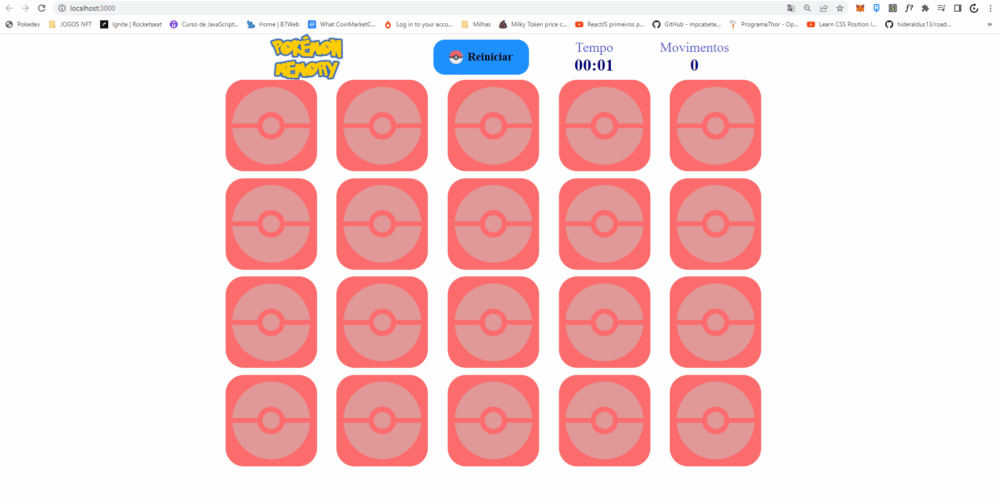

<h1 align='center'>Pokemon Memory</h1>
<p align='center'>Este projeto é um jogo da memória com contagem de jogadas feitas e tempo todal de jogo.</p>
<p><a href='https://david-pokemon-memory.netlify.app/'>Clique aqui para ver a aplicação funcionando</a></p>

<p align='center'>
<a href='#pré-requisito'>Pré Requisitos</a> |
<a href='#pré-requisito'>Rodando a Aplicação</a> |
<a href='#pré-requisito'>Tecnologias</a> |
<a href='#pré-requisito'>Autor</a> |
</p>
<hr>
<br>
<a href='https://rakunnotodolist.netlify.app/'>

</a>
<br>
<br>
<hr>


## Pré-Requisito

Você vai precisar ter instalado em sua máquina as seguintes ferramentas: <a href='https://git-scm.com/'>Git</a>, <a href='https://nodejs.org/en/'>Node.js</a>.

Você também vai precisar de um editor de codigo como o <a href='https://code.visualstudio.com/'>VSCode</a>

## Rodando a Aplicação
```bash
# Clone este repositório
$ git clone https://github.com/rakunno/Pokemon-Memory

# Acesse a pasta do projeto no terminal/cmd
$ cd Pokemon-Memory

# Instale as dependências
$ yarn install

#Execute a aplicação
yarn start

#Acesse a aplicação no endereço http://localhost:3000/
```

## Tecnologias
As seguintes tecnologias abaixo foi usada na construção do projeto:

- <a href='reactjs.org'>ReactJS</a>
- <a href='https://www.typescriptlang.org/'>Typescript</a>
- <a href='https://styled-components.com/'>Styled Components</a>
<hr>

## Autor
Made with 💜 by David Alves 👋